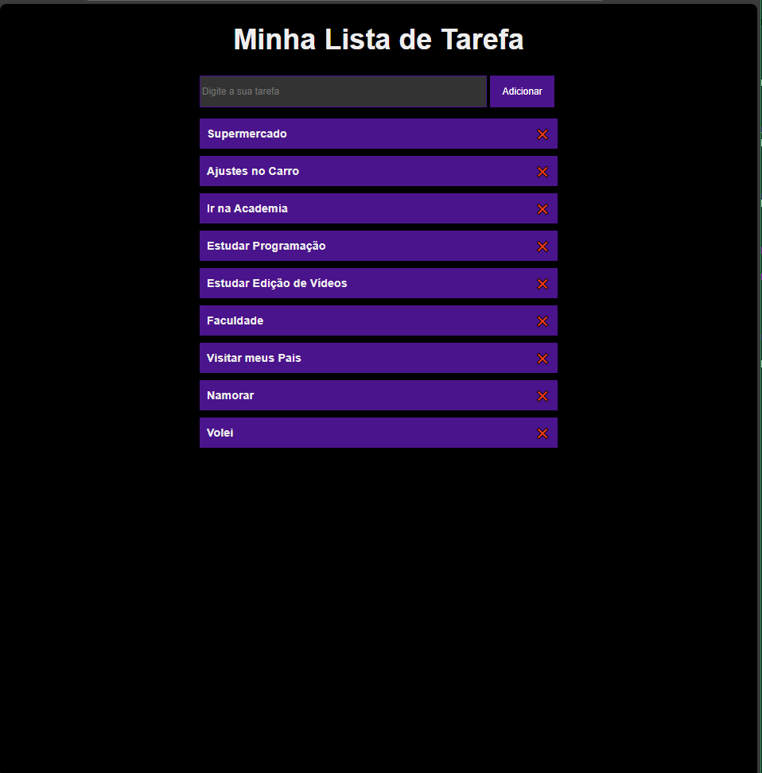

<h1 align="center"> TODO List </h1>

Projeto Portfólio em HTML, CSS e JAVASCRIPT.  

  <a href="#-tecnologias">Tecnologias</a>&nbsp;&nbsp;&nbsp;|&nbsp;&nbsp;&nbsp;
  <a href="#-projeto">Projeto</a>&nbsp;&nbsp;&nbsp;|&nbsp;&nbsp;&nbsp;
  <a href="#-layout">Layout</a>&nbsp;&nbsp;&nbsp;|&nbsp;&nbsp;&nbsp;
  <a href="#memo-licença">Licença</a>

 

  

## 🚀 Tecnologias

Esse projeto foi desenvolvido com as seguintes tecnologias:

- Html
- Css
- JavaScript
- Git e Github

## 💻 Projeto

Página de um TODO List (Lista de Tarefas).

- [Acesse o projeto finalizado, online](https://schubertsantos.github.io/todolist)

## 🔖 O que foi aprendido nesse Projeto de Estudos

- Página de TODO List (Lista de Tarefa).
- Inserção de tarefas e exclusão de tarefas. 
- Saber quando o botão foi clicado. 
- Pegar o texto dentro do Input. 
- Colocar esse texto na tela. 
- Deletar a tarefa da tela (Quando eu clicar  no X).

---

